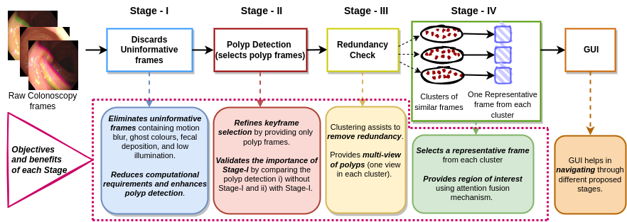
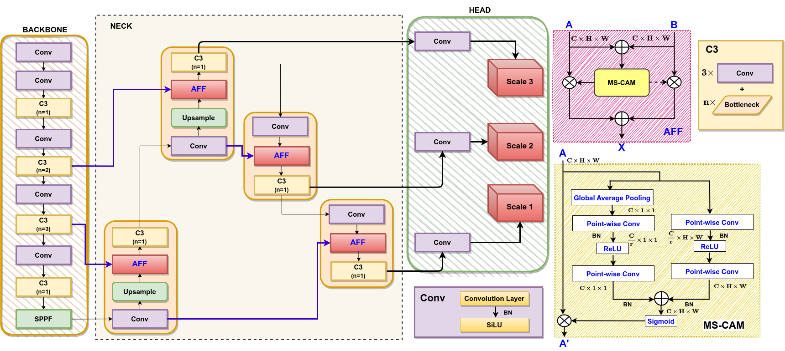
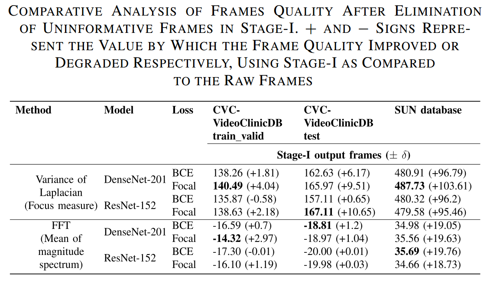
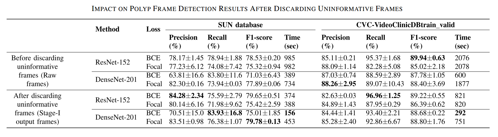
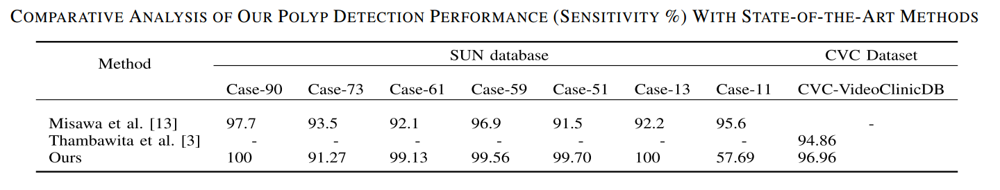
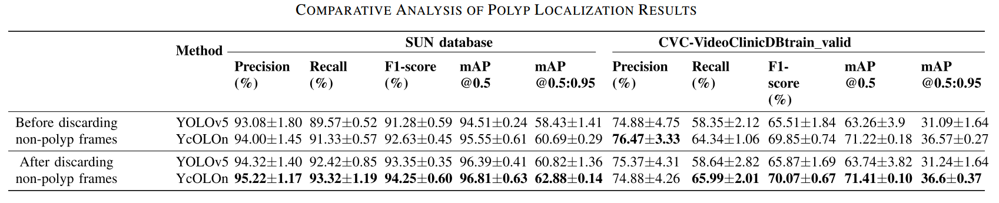
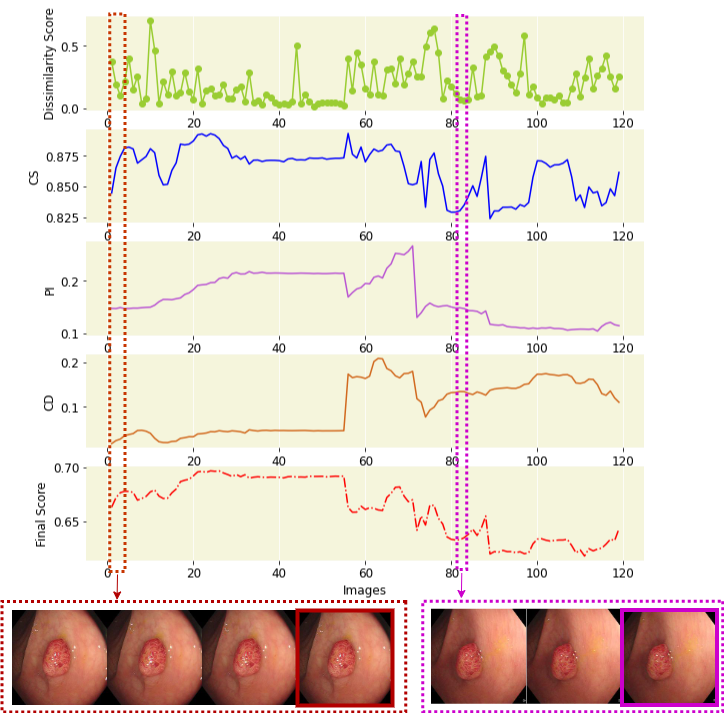
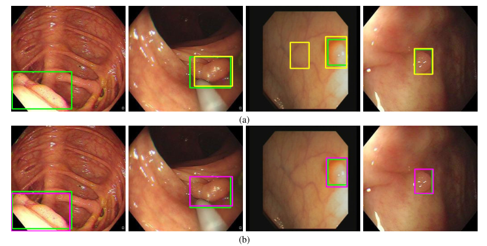

# A Multi-Scale Attention Framework for Automated Polyp Localization and Keyframe Extraction From Colonoscopy Videos

Paper Link: [https://ieeexplore.ieee.org/stamp/stamp.jsp?arnumber=10268934](https://ieeexplore.ieee.org/abstract/document/10268934/)

## 1. Introduction
Colonoscopy video acquisition has been tremendously increased for retrospective analysis, comprehensive inspection, and detection of polyps to diagnose colorectal cancer (CRC). However, extracting meaningful clinical information from
colonoscopy videos requires an enormous amount of reviewing time, which burdens the surgeons considerably. To reduce the manual efforts, we propose a first end-to-end automated multi-stage deep learning framework to extract an adequate number of clinically significant frames, i.e., keyframes from colonoscopy videos. The proposed framework comprises multiple stages that employ different deep learning models to select keyframes, which are high-quality, non-redundant polyp frames capturing multi-views of polyps. In one of the stages of our framework, we also propose a novel multi-scale attention-based model, **YcOLOn**, for polyp localization, which generates ROI and prediction scores crucial for obtaining keyframes. 

## 2. Framework Overview

*Figure 1:  Flowchart depicting the role of different stages in the proposed work.*

## 3. YcOLOn Architecture

*Figure 2: Different components of the proposed model. AFF is the attention feature fusion module, and MS-CAM is the multi-scale channel attention component of the AFF.*

## 4. Results
### 4.1 Stage-I: Quality Assessment


### 4.2 Stage-II: Polyp Detection



### 4.3 Stage-III and Stage-IV: Redundancy Removal and Polyp Localization


*Figure 3: The graph plots the dissimilarity scores, CS, PI, CD, and final scores of a video shot segmented from a patient’s video sequence. The two dotted boxes over the sub-plots represent two independent clusters. The keyframe selected from each cluster is highlighted.*


*Figure 4: Sample images illustrating the comparative analysis of the localization performance: (a) YOLOv5, and (b) YcOLOn. The green, yellow, and pink color bounding boxes denote the ground truth, YOLOv5, and YcOLOn predictions, respectively.*

## 5. Usage
#### Prerequisites
```
cd YcOLOn
pip install -r requirements.txt
```
Alternatively, you can use the Dockerfile provided at /YcOLOn/utils/docker/.

Set the dataset path in coco128.yaml provided at YcOLOn/data/.

#### Training YcOLOn
```
cd YcOLOn
python3 train.py --img 256 --batch 10 --epochs 20 --workers 0 --data coco128.yaml --weights '' --cfg YcOLOn.yaml
```

#### Validate/Test using YcOLOn
```
cd YcOLOn
python3 val.py --task test --img 256 --workers 0 --single-cls --save-txt --save-conf --weights ./runs/train/exp/weights/best.pt
```
Replace exp with the folder in which your model's best results are saved during training. 

#### Detect using YcOLOn
```
python3 detect.py --weights ./runs/train/exp/weights/best.pt --img 256 --source test.jpg --visualize --save-crop
```
Replace exp with the folder in which your model's best results are saved during training. 
Replace test.jpg with the image name which you want to test.

## 6. Citation:
```
@article{sharma2023multi,
  title={A Multi-Scale Attention Framework for Automated Polyp Localization and Keyframe Extraction From Colonoscopy Videos},
  author={Sharma, Vanshali and Sasmal, Pradipta and Bhuyan, MK and Das, Pradip K and Iwahori, Yuji and Kasugai, Kunio},
  journal={IEEE Transactions on Automation Science and Engineering},
  year={2023},
  publisher={IEEE}
}
```

Please contact vanshalisharma@iitg.ac.in if you have questions about our work and research activities. We always welcome collaboration and joint research!

This repository will be updated soon!
